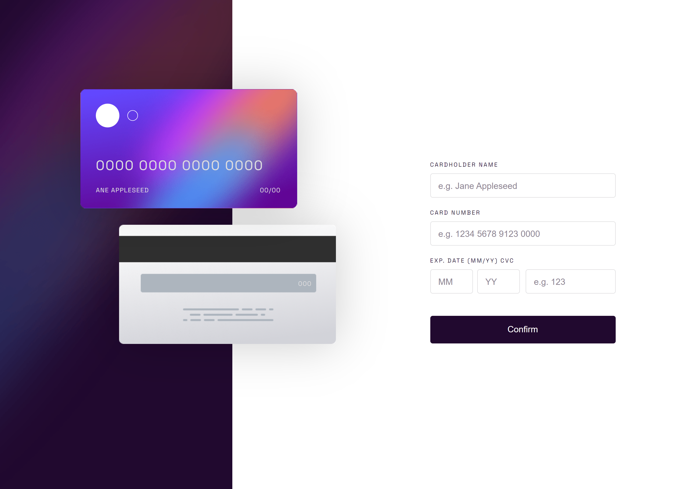
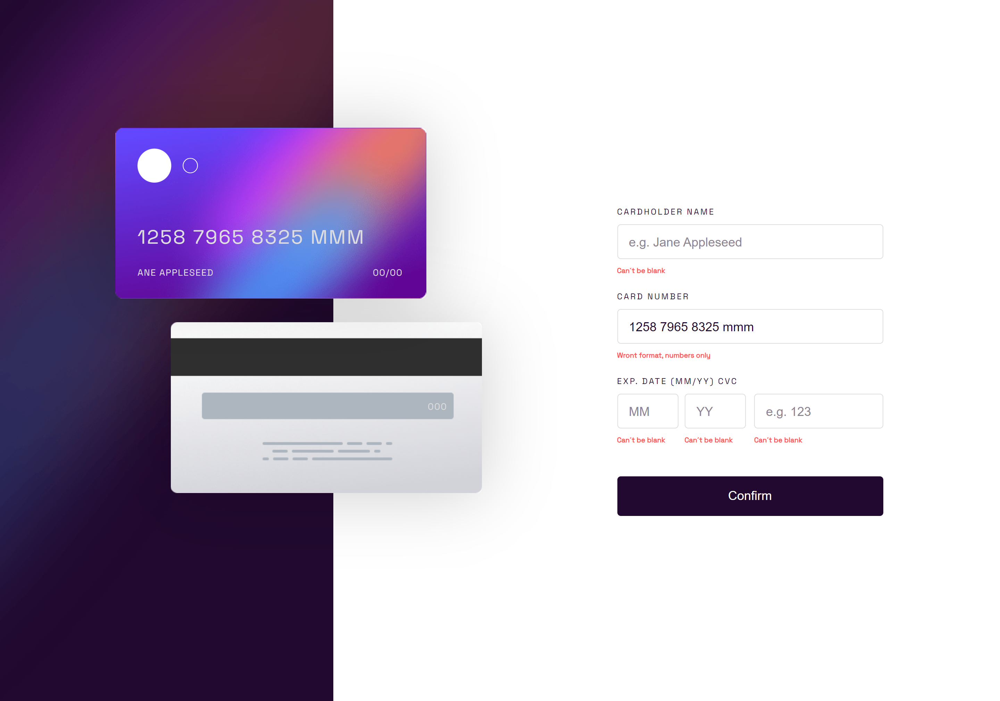
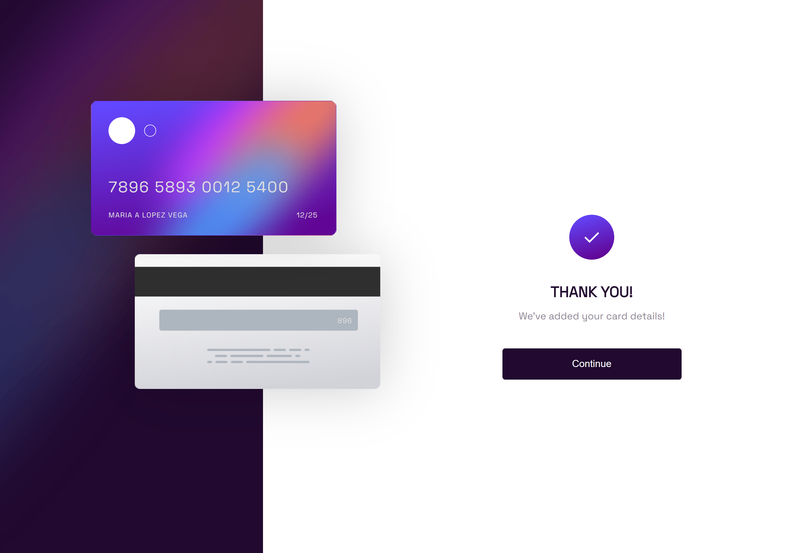
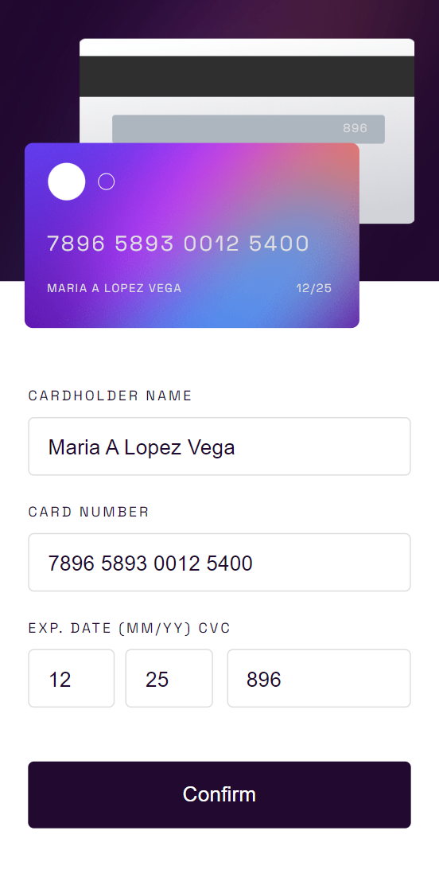
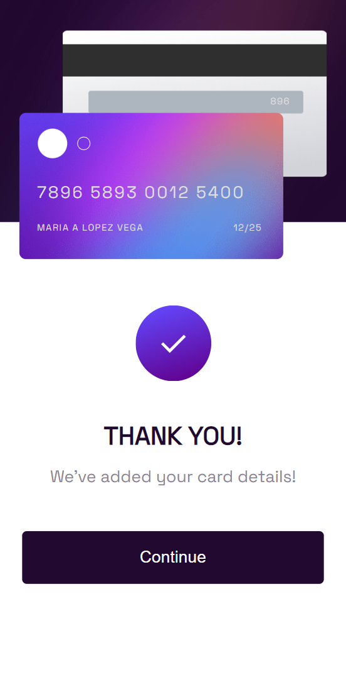

# Frontend Mentor - Interactive card details form solution

This is a solution to the [Interactive card details form challenge on Frontend Mentor](https://www.frontendmentor.io/challenges/interactive-card-details-form-XpS8cKZDWw). Frontend Mentor challenges help you improve your coding skills by building realistic projects.

## Table of contents

- [Overview](#overview)
  - [The challenge](#the-challenge)
  - [Screenshot](#screenshot)
  - [Links](#links)
- [My process](#my-process)
  - [Built with](#built-with)
  - [What I learned](#what-i-learned)
  - [Continued development](#continued-development)
  - [Useful resources](#useful-resources)
- [Author](#author)

## Overview

### The challenge

Users should be able to:

- Fill in the form and see the card details update in real-time
- Receive error messages when the form is submitted if:
  - Any input field is empty
  - The card number, expiry date, or CVC fields are in the wrong format
- View the optimal layout depending on their device's screen size
- See hover, active, and focus states for interactive elements on the page

### Screenshot







### Links

- Solution URL: [https://github.com/oppahero/interactive-card-details-form-main](https://github.com/oppahero/interactive-card-details-form-main)
- Live Site URL: [Add live site URL here](https://your-live-site-url.com)

## My process

### Built with

- Semantic HTML5 markup
- CSS custom properties
- Flexbox
- CSS Grid
- Mobile-first workflow
- [React](https://reactjs.org/) - JS library
- [Next.js](https://nextjs.org/) - React framework

This is a [Next.js](https://nextjs.org/) project bootstrapped with [`create-next-app`](https://github.com/vercel/next.js/tree/canary/packages/create-next-app).

First, run the development server:

```bash
npm run dev
# or
yarn dev
# or
pnpm dev
# or
bun dev
```

Open [http://localhost:3000](http://localhost:3000) with your browser to see the result.

### What I learned

This is my first time using the Nextjs framework so I am currently learning about it.

Also putting my react knowledge into practice.

-Page routing
-Layout concept
-Module styles
-Nextjs image component
-UseState of react
-Formik
-Yup

### Continued development

In this practice I only have one page, but I want to try a project with a few different pages to implement the nextJs router.

### Useful resources

- [Dynamic forms with formik](https://dev.to/franklin030601/formularios-dinamicos-con-formik-y-react-js-4hne)

- [Next.js Documentation](https://nextjs.org/docs) - learn about Next.js features and API.

## Author

- Frontend Mentor - [@oppahero](https://www.frontendmentor.io/profile/oppahero)
